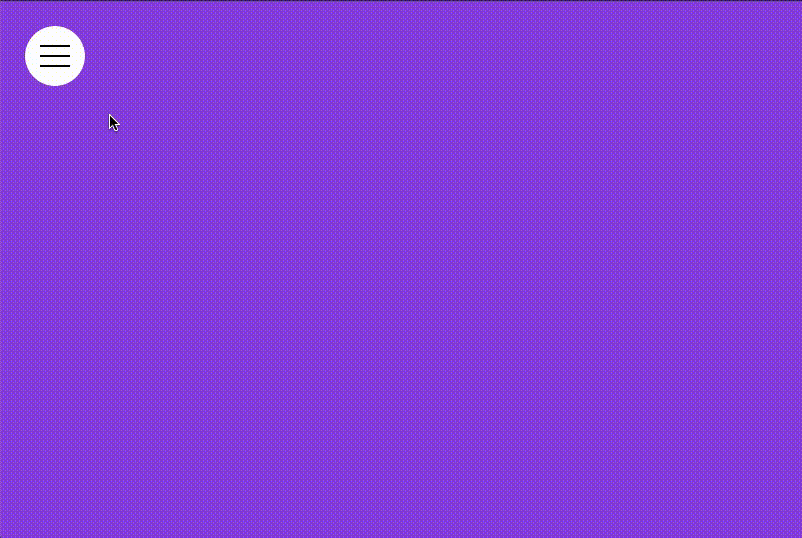
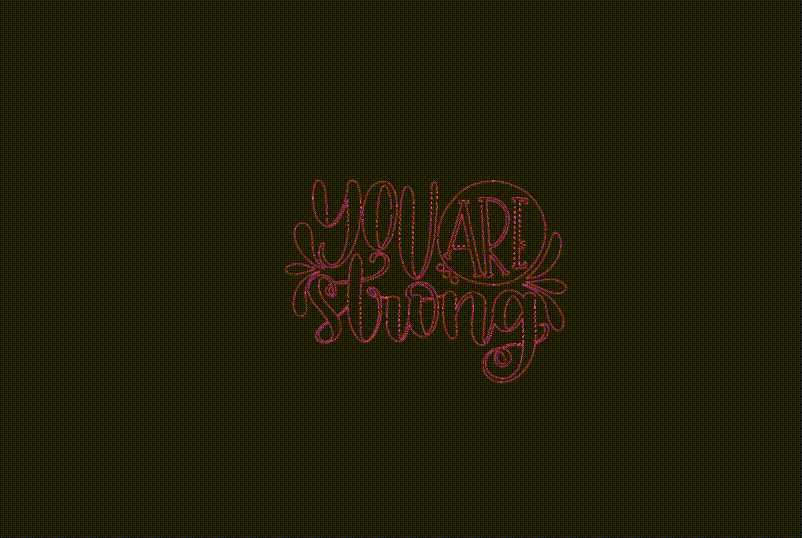
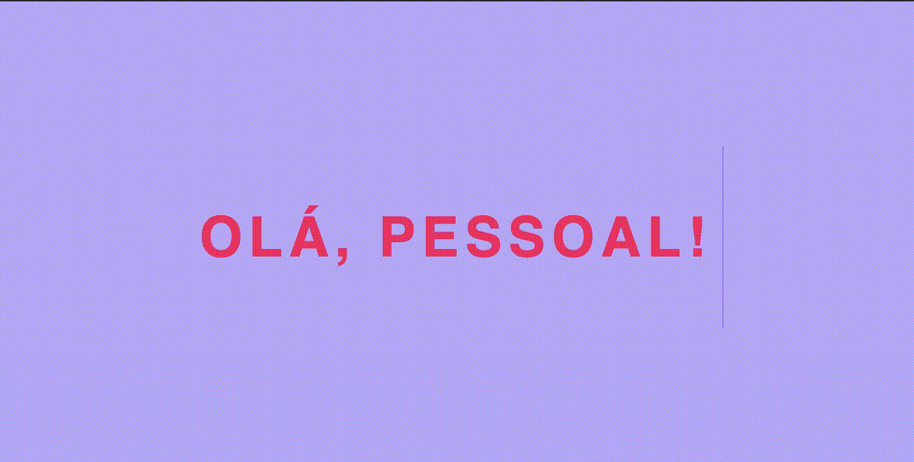

<h1 align="center"> <strong> CSS PURO </strong></h1>

### Sobre

Repositório dedicado a contribuir com mini projetos utilizando CSS3.   

---

### Relação

- 01 - Menu Hambúrguer 

  

 

- 02 - Animação de Letras SVG

  

 

- 03 - Spinner Loader

  

 

- 04 - Light Box

  

 

- 05 - Bloco Revelador

  

 